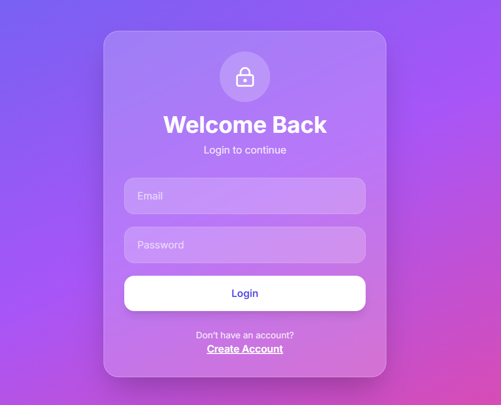
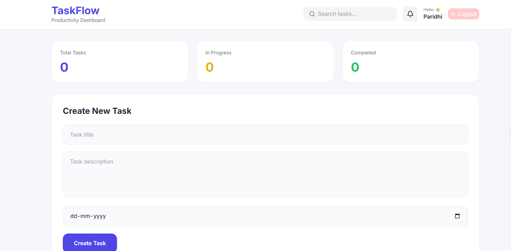
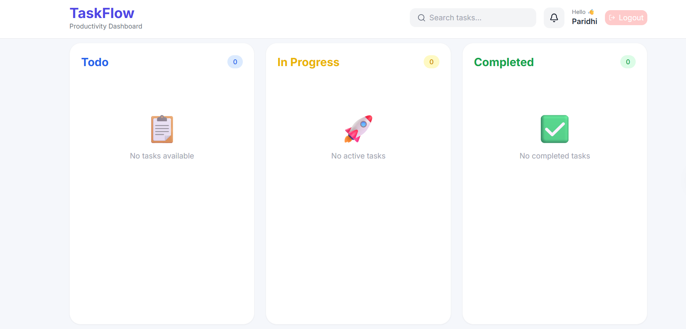

# 🚀 TaskFlow

Built with React, Node.js, Express, Prisma ORM, Supabase PostgreSQL, JWT Authentication, and Brevo Email Verification.
A production-ready full-stack task management platform that helps users organize, track, and manage their tasks efficiently.

TaskFlow features secure JWT authentication, OTP-based email verification via Brevo, task progress tracking, and a responsive dashboard built with modern web technologies including React, Express, Prisma, and Supabase PostgreSQL.

---

## 🌐 Live Demo

### Frontend

https://task-flow-three-ecru.vercel.app

### Backend API

https://taskflow-dy5l.onrender.com

### GitHub Repository

https://github.com/paridhijain153/TaskFlow

---

# ✨ Features

## 🔐 Authentication & Security

* User Registration & Login
* Email OTP Verification
* JWT-Based Authentication
* Password Hashing using bcryptjs
* Protected Routes
* Secure Session Management

## 📧 Email Verification

* OTP Generation & Validation
* Brevo SMTP Integration
* Expiring OTP System
* Secure Account Activation Workflow

## 📋 Task Management

* Create Tasks
* Edit Tasks
* Delete Tasks
* Track Task Progress
* Manage Due Dates
* Status-Based Task Organization

### Supported Task Statuses

* TODO
* IN_PROGRESS
* COMPLETED

## 🎨 User Experience

* Clean and Responsive UI
* Mobile-Friendly Design
* Toast Notifications
* Intuitive Navigation
* Modern Dashboard Interface

---

# 🛠️ Tech Stack

## Frontend

* React.js
* Vite
* Tailwind CSS
* React Router DOM
* Axios
* React Hot Toast
* Lucide React

## Backend

* Node.js
* Express.js
* Prisma ORM
* Zod Validation
* JWT Authentication
* bcryptjs
* Brevo SMTP Integration

## Database

* Supabase PostgreSQL

## Deployment

* Vercel (Frontend)
* Render (Backend)
* Supabase (Database)

## AI Tools Used

The following AI tools were used to accelerate development and learning:

- ChatGPT
- GitHub Copilot (if used)
- Cursor AI (if used)

AI was used for:
- Debugging
- Code review
- Architecture discussions
- Documentation generation

All implementation, customization, testing, and deployment were completed manually.

---

# 🏗️ Architecture

```text
Client (React + Vite)
        │
        ▼
REST API (Express.js)
        │
        ▼
Prisma ORM
        │
        ▼
Supabase PostgreSQL
```

---

# 🔄 Authentication Flow

```text
Signup
   │
   ▼
Enter Email
   │
   ▼
Receive OTP via Brevo
   │
   ▼
Verify OTP
   │
   ▼
Complete Signup
   │
   ▼
Login
   │
   ▼
JWT Token Generated
   │
   ▼
Dashboard Access
```

---

# 📁 Project Structure

```text
TaskFlow
│
├── task-dashboard-backend
│   │
│   ├── prisma
│   │   ├── migrations
│   │   └── schema.prisma
│   │
│   ├── src
│   │   ├── controllers
│   │   ├── middlewares
│   │   ├── prisma
│   │   ├── routes
│   │   ├── services
│   │   ├── utils
│   │   ├── validators
│   │   ├── app.js
│   │   └── server.js
│   │
│   ├── .env
│   └── package.json
│
└── task-dashboard-frontend
    │
    ├── src
    │   ├── components
    │   ├── pages
    │   ├── services
    │   ├── App.jsx
    │   ├── main.jsx
    │   └── index.css
    │
    ├── .env
    ├── package.json
    ├── tailwind.config.js
    ├── postcss.config.js
    └── vercel.json
```

---

# ⚙️ Environment Variables

## Backend (.env)

```env
DATABASE_URL=
DIRECT_URL=

PORT=5000

JWT_SECRET=

CLIENT_URL=https://task-flow-three-ecru.vercel.app

BREVO_LOGIN=
BREVO_SMTP_KEY=
BREVO_API_KEY=
```

## Frontend (.env)

```env
VITE_API_URL=https://taskflow-dy5l.onrender.com
```

---

# 🚀 Getting Started

## Clone the Repository

```bash
git clone https://github.com/paridhijain153/TaskFlow.git
cd TaskFlow
```

---

## Backend Setup

```bash
cd task-dashboard-backend

npm install

npx prisma generate

npx prisma migrate deploy

npm run dev
```

Backend runs on:

```bash
http://localhost:5000
```

---

## Frontend Setup

```bash
cd task-dashboard-frontend

npm install

npm run dev
```

Frontend runs on:

```bash
http://localhost:5173
```

---

# 📡 API Endpoints

## Authentication

| Method | Endpoint         | Description   |
| ------ | ---------------- | ------------- |
| POST   | /auth/send-otp   | Send OTP      |
| POST   | /auth/verify-otp | Verify OTP    |
| POST   | /auth/signup     | Register User |
| POST   | /auth/login      | Login User    |

## Tasks

| Method | Endpoint   | Description     |
| ------ | ---------- | --------------- |
| GET    | /tasks     | Fetch All Tasks |
| POST   | /tasks     | Create Task     |
| PUT    | /tasks/:id | Update Task     |
| DELETE | /tasks/:id | Delete Task     |

---

# 🔍 Validation & Security

### Backend Validation

* Request Validation using Zod
* Input Sanitization
* Structured Error Handling

### Security Measures

* JWT Authentication
* Password Hashing using bcryptjs
* Protected API Routes
* OTP Expiration Validation
* Environment Variable Protection

---

# 🎯 Key Learnings

This project demonstrates practical experience with:

* Full-Stack Development
* REST API Design
* Authentication & Authorization
* Email Verification Systems
* PostgreSQL Database Management
* Prisma ORM
* Frontend-Backend Integration
* Production Deployment
* Environment Configuration
* Form Validation & Error Handling

---

# 🚀 Future Improvements

* Task Search & Filtering
* Drag-and-Drop Kanban Board
* User Profile Management
* Dark Mode
* Team Collaboration Features
* Real-Time Notifications
* Task Analytics Dashboard
* File Attachments

---

# 📸 Screenshots

Add screenshots inside a `screenshots` folder and reference them like:


## Login Page


## Dashboard


## Task Management




---

# 👩‍💻 Author

### Paridhi Jain

Full Stack Developer

GitHub: https://github.com/paridhijain153/TaskFlow

---

# ⭐ Support

If you found this project useful, consider giving it a star on GitHub.

It helps others discover the project and motivates future improvements.

---

# 📄 License

This project is licensed under the MIT License.